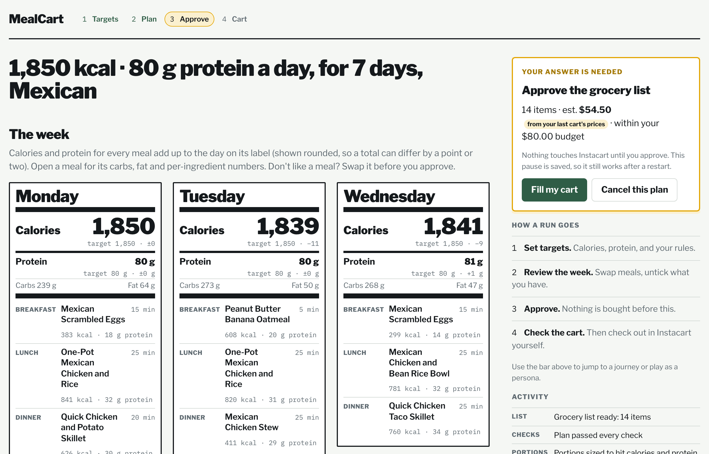
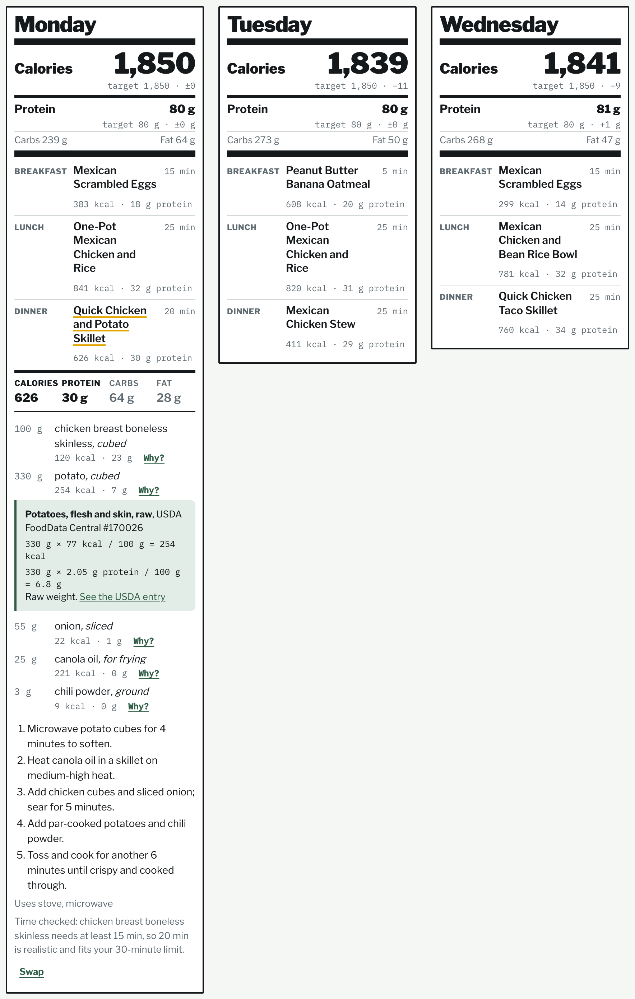
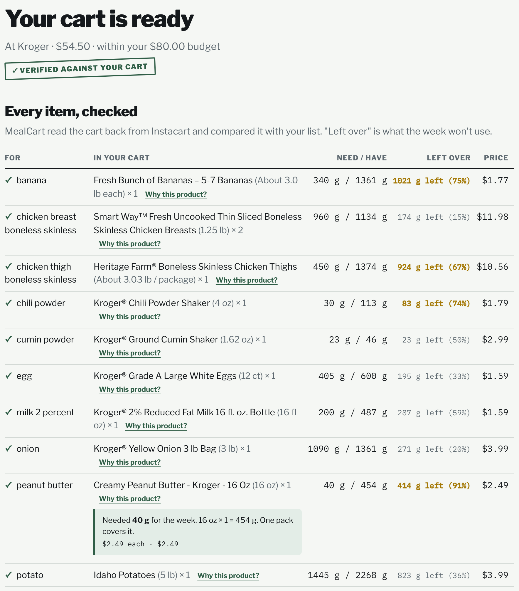
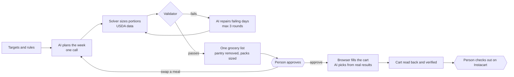

# MealCart

**A week of meals that hits your calorie and protein targets, turned into a grocery cart you only
have to check out.**

MealCart plans seven days of meals, checks every day against USDA nutrition data, and fills your
Instacart cart. It stops at a filled, verified cart; **you always check out yourself.**

| | |
|---|---|
| Run it locally | [RUNNING.md](RUNNING.md) |
| Clickable design prototype | [srinathvenkatesh25.github.io/mealcart-design/prototype](https://srinathvenkatesh25.github.io/mealcart-design/prototype/) |
| How I compared AI models | [docs/AI_EVALS.md](docs/AI_EVALS.md) |
| Architecture diagram | [docs/architecture.html](docs/architecture.html) (download and open in a browser) |
| What was built, risks hit, what was verified | [docs/project-report.md](docs/project-report.md) |

---

## Product requirements document

| | |
|---|---|
| **Owner** | Srinath Venkatesh |
| **Status** | v1 shipped (single-user, local). The roadmap is below. |
| **Last updated** | October 2026 |

### At a glance

| | |
|---|---|
| **Problem** | Eating to a calorie and protein target means planning meals, sizing portions, building a list, and shopping: four tools and a lot of arithmetic. General-purpose AI can draft a plan but can't be trusted with the numbers. |
| **Users** | Busy people who want a realistic plan, budget-conscious shoppers, and people easing into healthier eating |
| **What v1 does** | Plans 7 days in one AI call. Sizes every portion with a solver. Checks the plan against USDA data and the user's rules. Builds one consolidated list. Waits for approval. Fills the Instacart cart. Reads the cart back to check it. |
| **Results on a sample week** | Every day within ±5% of 1,850 kcal and ±10 g of 80 g protein. A 14-item cart at $54.50 against an $80 budget, 14 of 14 items covered. 4 AI calls. $0 in AI cost. |
| **Never** | Checks out, pays, or stores sign-in codes |

---

## 1. Problem

Hitting a nutrition target week after week takes four separate jobs:
1. deciding what to eat
2. sizing portions so the numbers add up
3. turning seven days of recipes into a shopping list
4. buying the right pack sizes without overspending

Calorie trackers, recipe apps and grocery delivery each handle one of these. The person still does
the coordination and the arithmetic, and that's where plans get abandoned.

AI makes the first job easy, but it doesn't solve the others. In my [prompting study](docs/AI_EVALS.md), three
general-purpose models planned a week and built a cart from a product catalog:
- None reliably covered the cart; the best scored 6 of 12 on coverage.
- Two of the three got nutrition wrong in most scenarios.
- One invented products and prices.
- One called a plan feasible after flagging that it broke a time limit.

The opportunity is a product that uses AI for what it's good at, choosing meals people will actually
eat, and uses software for everything that can be measured.

## 2. Target users and personas

Three personas, each with a different reason to use MealCart and a different way to lose trust in it.

### The Always-on-the-Go Planner
| | |
|---|---|
| **Needs** | Quick, low-effort meals made with accessible ingredients |
| **Jobs to be done** | Generate a quick, realistic weekly plan. Find fast-prep meals. Adjust meals conversationally as the schedule changes. |
| **Success looks like** | Less time planning and preparing. Meals that fit the schedule. Fewer decisions. |
| **Mental model** | *"An assistant that does the planning so I don't have to think."* Expects a good default the first time, and a one-sentence way to change it. |
| **Loses trust when** | A "15-minute" meal takes 45 |

### The Budget-Savvy Shopper
| | |
|---|---|
| **Needs** | Affordable, nutritious options with less waste |
| **Jobs to be done** | Set a weekly budget. Reuse ingredients across meals. Review and approve an affordable, low-waste cart. |
| **Success looks like** | Cart within budget. Nothing unnecessary. Less food thrown away. |
| **Mental model** | *"A cart builder I audit before money is spent."* Wants the total against the budget before shopping, and every line after. |
| **Loses trust when** | Items appear that they didn't approve, or the total surprises them |

### The On-and-Off Dieter
| | |
|---|---|
| **Needs** | Gradual, realistic changes built around familiar foods |
| **Jobs to be done** | Build healthier meals around familiar foods. Improve portions and balance. Introduce healthier alternatives gradually. |
| **Success looks like** | Manageable changes without a restrictive diet. Sticks with the plan. |
| **Mental model** | *"A coach that nudges, not a strict diet."* |
| **Loses trust when** | The plan feels foreign, or the numbers look made up |

## 3. User journeys

| # | Journey | Persona focus | Outcome |
|---|---|---|---|
| J1 | **Set targets → plan.** Calories, protein, ZIP, budget, cuisines, dislikes, time limit, equipment, pantry; or describe the week in a sentence. | Planner | A checked 7-day plan in about a minute, with live progress |
| J2 | **Review and question.** Each day is shown as a nutrition label; every meal shows its calories and protein, and opens to per-ingredient numbers. Swap a meal by saying why. Untick what you already have. | Dieter, Planner | A plan the person understands and has adjusted |
| J3 | **Approve.** Item count and estimated cost against the budget. Fill the cart, swap again, or cancel. | Shopper | Nothing is bought without an explicit yes |
| J4 | **Shop.** A hidden browser ranks stores, picks products, sizes packs and adds them. It pauses for the sign-in code, an existing cart, or a substitute that breaks the plan. | Shopper | A filled cart, across up to 3 stores if needed |
| J5 | **Verify and hand off.** The cart is read back and compared item by item with the list. Then open Instacart and check out. | Shopper | The person pays, knowing the cart matches the plan |

*Screens are from the [design prototype](https://srinathvenkatesh25.github.io/mealcart-design/prototype/), which also
shows roadmap features (the USDA **Why?** panel, **Why this product?**, and the left-over column).*

## 4. Goals and non-goals

**Goals**
1. Hit two targets reliably: calories (±5%) and protein (±10 g) every day, on the first pass where possible.
2. Turn the plan into a cart the person can trust without re-checking it themselves.
3. Keep the person in control of every decision that spends money or changes what they eat.
4. Cost nothing to run.

**Non-goals (v1)**
- **Checkout or payment.** No automated purchase, ever.
- **Carb and fat targets.** These are shown but not targeted, because two targets can be hit exactly.
- **Meal logging or adherence tracking.**
- **Multiple users, households, or phone access.** v1 is single-user and runs on your own Mac.
- **Paid AI models.**

## 5. Success metrics

| Metric | Why it matters | v1 evidence | Target |
|---|---|---|---|
| **North star: runs that reach a verified cart within targets, with no manual fixes** | The whole promise in one number | Sample week: yes (7/7 days in range, 14/14 items) | ≥ 80% of runs |
| First-pass validation rate | Fewer repair rounds means faster plans and less AI quota | Sample week passed first time; the solver makes the targets reachable on the first pass | ≥ 70% of plans |
| Cart coverage | An incomplete cart means a second shopping trip | 14/14 on the sample week; a single-store run missing 5 items led to multi-store shopping | 100% for "cart ready" |
| Cost against budget, shown before approval | The Shopper's main trust signal | Estimate on the approval card; $54.50 of $80 | No surprises: the subtotal is within the estimate |
| AI calls per run | Free quotas are small | 4 on the sample week (down from 6 for the plan alone in the first design) | ≤ 10 typical, hard cap 40 |
| Time to a plan | The Planner's patience | About a minute, with live progress | ≤ 60 s |
| Realistic cooking times | One wrong time ends trust | Time floors corrected 10–14 of 35 meals on saved plans and flagged 2 as impossible | 0 meals over the user's limit |

v1 has run on a handful of real weeks, so these are early signals. The targets are what I'd hold the
next version to.

## 6. Requirements

**P0 (must have)**

| Requirement | Acceptance criteria | Status |
|---|---|---|
| Calorie and protein targets | Every day within ±5% kcal and ±10 g protein, or the day goes to repair with a specific reason | Shipped |
| Rules are enforced, not just requested | Allergies, restrictions, dislikes, time limit, equipment, steps and variety are checked in code after the AI plans | Shipped |
| Approval gate | Nothing touches the store until the person approves the plan and list; the pause survives a restart | Shipped |
| Cart verification | The cart is read back and every list item compared; "ready" only when all are covered | Shipped |
| No checkout | No code path reaches checkout; the browser blocks checkout and payment pages | Shipped |
| Secrets never stored | Sign-in codes pass straight through and are never written to disk or logs | Shipped |

**P1 (should have)**

| Requirement | Acceptance criteria | Status |
|---|---|---|
| Swap a meal | One AI call replaces it; only that day is re-sized and re-checked; the person approves again | Shipped |
| Edit the list | Untick items you have; the count and estimate update; the approved list is the one shopped | Shipped |
| Pantry | Pantry items are never bought | Shipped |
| Multi-store | Items the best store lacks are bought at the next stores, up to 3 | Shipped |
| ZIP check | Warns if Instacart delivers somewhere other than the user's ZIP | Shipped |
| Transparent failures | Model switches, human checks and missing items are explained in plain language | Shipped |

**P2 (next)**

| Requirement | Persona | Status |
|---|---|---|
| **Why?** on any number, showing the USDA entry and the arithmetic | Dieter | Roadmap (in prototype) |
| **Why this product?**: the picker's reason and pack maths | Shopper | Roadmap (in prototype) |
| Leftover per item: what the week won't use | Shopper | Roadmap (in prototype) |
| Gradual-change mode: one small healthier swap a week | Dieter | Roadmap (in prototype) |
| Locked preferences ("don't change my chicken lunch") | Planner | Roadmap |
| Cart edits show which meals are affected | Shopper | Roadmap |

**Non-functional requirements**
- **Privacy:** single user, local only, nothing exposed to the network. API keys stay in `.env`.
- **Cost:** $0 per run, on free AI tiers with automatic fallback.
- **Reliability:** the approval pause survives a server restart, and live progress resumes after a dropped connection.
- **Accessibility:** keyboard reachable, visible focus, reduced motion respected, WCAG AA contrast.

## 7. How it works

**Division of labour.**
- The AI chooses meals and picks among real search results.
- Python does every number: portions, macros, pack counts, prices, timings.
- The person makes every decision that spends money or changes what they eat.

**Stack:** Python and FastAPI; LangGraph for the run, with checkpointed pauses; SciPy for portion
sizing; USDA FoodData Central; Playwright driving Chrome; Next.js for the page; free Gemini and Groq
models. The full diagram is in [docs/architecture.html](docs/architecture.html), and the code layout is in [AGENTS.md](AGENTS.md).

## 8. Key decisions and tradeoffs

| Decision | Options considered | Chose | What I gave up, and why it was worth it |
|---|---|---|---|
| **Who does the arithmetic** | The model computes portions and totals, or code does | Code: a bounded least-squares solver over USDA data | Less flexible meal-level creativity, because the model proposes ingredients and the solver sets the grams. In my evals, nutrition accuracy was 3/12 for two of three models. |
| **Which nutrients are targets** | All macros, or calories and protein | Calories and protein are gated; carbs and fat are shown | Less control for macro-focused users. Two targets can be hit exactly on the first pass; four rarely can. |
| **Where the human decides** | Fully automatic, approval at the end, or approval before spending | A gate before any shopping, plus pauses for risky substitutes and an existing cart; checkout always manual | One more click, in exchange for zero chance of an unwanted purchase. |
| **When the cart is built** | Update the cart live as meals change, or build it once the plan is final | Build only after approval; a swap sends the plan back for re-approval | No live cart preview. In exchange, no half-updated carts and no wasted store actions. |
| **How the browser is driven** | A general browser agent, or fixed steps with AI choices | Fixed Playwright steps; the AI only chooses among scraped results | Breaks when the site changes; mitigated by keeping all selectors in one tested file. In exchange: deterministic, cheap, debuggable, and checkout is unreachable. |
| **Which models** | The strongest paid model, or free tiers | Free tiers (Gemini, then Groq) with a fallback chain | The best model in my evals wasn't free. The architecture moves every measurable task into code, so a weaker model is enough. |
| **How often to call the AI** | Per day, or per week | One call for the whole week, split automatically if a provider rejects the size | Bigger requests, and some providers cap request size. In exchange, a plan uses 1 request instead of 6 against a quota of about 20 a day. |
| **Browser visibility** | Visible window, or hidden | Hidden by default; a window opens only for sign-in | A hidden browser can't pass a CAPTCHA, so the run stops with an explanation rather than misreporting items. |
| **How many stores** | One store, or many | Up to 3, ranked by who stocks the hardest-to-find items | Each store is a separate cart with its own fees. In exchange, near-complete coverage. |
| **ZIP code** | Change Instacart's address, or check it | Check and warn, never change | The user fixes a mismatch themselves; MealCart never edits their account. |
| **Cooking times** | Trust the AI's estimate, or apply floors | Conservative minimums for slow foods (raw rice and chicken ≥ 15 min, dried beans ≥ 50) | Some times are cautious. In exchange, no "5-minute" pulao. |

## 9. Decision rights

**The rule:** the system decides what is reversible and checked; the person signs anything that spends
money, changes what they'll eat beyond their rules, or touches their account.

| Decision | Who decides |
|---|---|
| Approve the plan and list | Person |
| Swap a meal, untick an item, cancel | Person |
| A substitute that breaks the plan's checks | Person |
| Empty a cart that already has items | Person |
| Sign-in codes and CAPTCHAs | Person (never stored) |
| Checkout and payment | Person only, outside MealCart |
| Portions, validation, up to 3 repair rounds | MealCart, within the person's targets and rules |
| Store ranking, product picks, pack counts | MealCart, within the approved list |

## 10. AI evaluation

I evaluated three models (Claude Sonnet 5.5, Microsoft 365 Copilot with GPT-5 chat, and Gemini 3.6
Flash). Each model ran six scenarios, scored on a 12-metric rubric with eight safety gates.

| | Claude Sonnet 5.5 | Copilot (GPT-5 chat) | Gemini 3.6 Flash |
|---|---:|---:|---:|
| Total score (of 144) | 129 | 74 | 60 |
| Scenarios with a critical failure | 1 of 6 | 0 of 6 | 4 of 6 |
| Cart coverage (of 12) | 6 | 3 | 2 |

**Takeaway:** no model can own coverage, arithmetic or constraint checks, so MealCart doesn't ask it
to. The method, the per-metric results, the failure examples and runtime data from the app are all in
[docs/AI_EVALS.md](docs/AI_EVALS.md).

## 11. Risks and mitigations

| Risk | Mitigation |
|---|---|
| **Accidental purchase** | No checkout code path. A request guard blocks checkout, order and payment traffic, and blocks anything it can't inspect. No saved card on the account. |
| **Wrong nutrition match** (USDA's top hit for "turmeric" was bison) | Results must contain the food's own words; raw entries are preferred; staples are aliased; 38 staples were re-checked live |
| **Free AI quotas run out** | One call per week; five-model fallback; a 40-call cap per run; every switch shown to the user |
| **The store's website changes** | All selectors live in one file, with parsers tested against text captured from the live site |
| **Store terms on automation** | Personal, human-paced use on one account; the person solves any CAPTCHA |
| **Contradictory input** (vegetarian + chicken) | Resolved at intake with a visible notice |

## 12. Roadmap

| Next | Why it's next |
|---|---|
| **Why?** panels and **Why this product?** | They're the cheapest trust gain: the data already exists in the backend |
| Leftover cue, showing cost per gram used | It answers the Shopper's waste question, and pricing it per gram used avoids pushing pricier small packs |
| Gradual-change mode | Serves the Dieter. Needs fiber tracking to show the real benefit. |
| Locked preferences, and cart edits that show meal impact | Requested in interviews; both need a new constraint layer |
| Sign-in and phone access | The largest reach gain, but only after the server has authentication |

## 13. What I learned

- **A prompt is a request, not a guarantee.** Every rule the model is given is checked again in code.
- **Trust comes from what people can check, not from confidence.** A cart compared line by line beats a "looks good" summary.
- **Free tiers shaped the architecture.** Quotas and request-size limits produced the one-call week, the fallback chain and request splitting.
- **The best model isn't always the right model.** Moving the measurable work into code made the cheapest model good enough.

---

**Repository:** [RUNNING.md](RUNNING.md) (setup and run) · [docs/AI_EVALS.md](docs/AI_EVALS.md) ·
[docs/project-report.md](docs/project-report.md) · [docs/build-plan.md](docs/build-plan.md) ·
[AGENTS.md](AGENTS.md) (code guide) · `backend/` · `frontend/` · `tests/` (233 tests)
